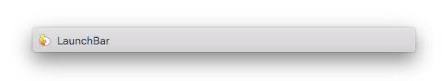
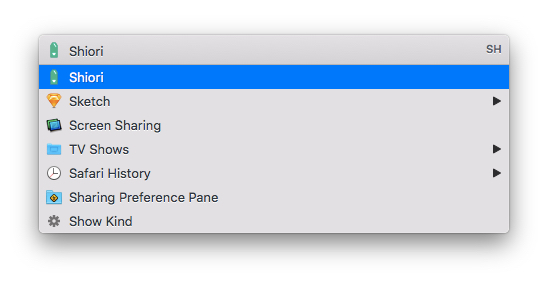
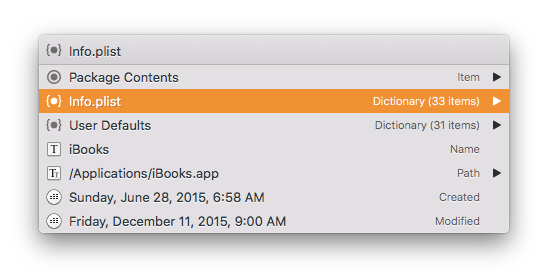

# El Capitan Small

This is a theme for [LaunchBar 6](https://www.obdev.at/products/launchbar/index.html) inspired by Small, the default theme for LaunchBar 5.

El Capitan Small differs from the classic Small theme in a number of ways. Mainly, the abbreviations font weight is bolder, there are no badges or accent colours when info browsing, and the text input background is colourless.

I'd greatly appreciate any suggestions you have that could help me make this theme any better. And I hope you enjoy using it!

## Installation

Download [this repository as a .zip file](https://github.com/benjaminwil/LaunchBar-ElCapitanSmall/archive/master.zip) and open the **El Capitan Small.lbtheme** file with LaunchBar. If you want to remove it in the future, you'll find the file in your **~/Library/Application Support/LaunchBar/Themes/** directory.

## Acknowledgements

This theme of course wouldn't be possible without [Objective Development](https://www.obdev.at) and LaunchBar—and without access to Objective Development's own El Capitan and Small themes. Thanks! 🦀
