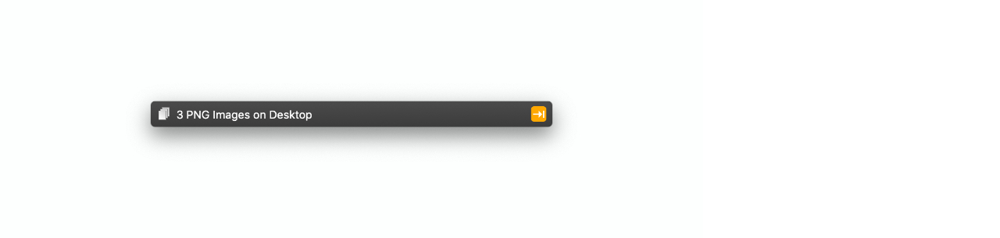

# Bijou (LaunchBar Theme)

Bijou is a theme for [LaunchBar 6][lb] inspired by Vintage (also called Small),
the default theme for LaunchBar 5. Previously, this theme was called El Capitan
Small, but has since been updated for macOS Mojave.

Bijou comes with a light and a dark variant.

Bijou differs from the Vintage theme in a number of ways. Mainly, the
abbreviations font weight is bolder, there are no badges or accent colours when
info browsing, and the text input background is colourless.

## Installation

Download [this repository as a .zip file][dl]  and open the `Bijou
Light.lbtheme` and/or `Bijou Dark.lbtheme` files. 

If you want to remove Bijou in the future, you can find the installed `.lbtheme`
files in your `~/Library/Application Support/LaunchBar/Themes/` directory.

## Acknowledgements

This theme wouldn't be possible without [Objective Development][od] and
LaunchBar—and without access to Objective Development's own Base, Base Dark, and
Vintage themes. Thanks! 🦀

[dl]: https://github.com/benjaminwil/bijou/archive/master.zip
[lb]: https://www.obdev.at/products/launchbar/index.html
[od]: https://www.obdev.at
